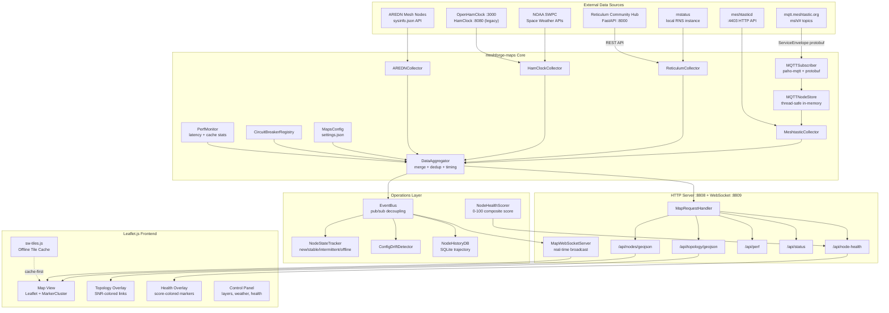
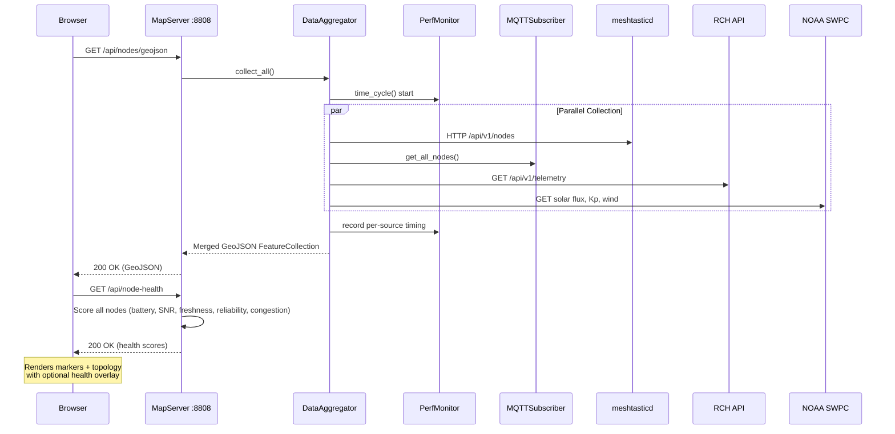
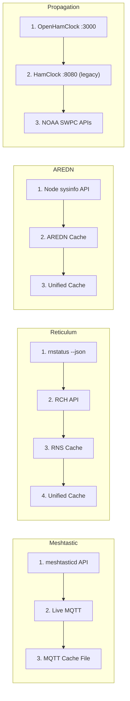
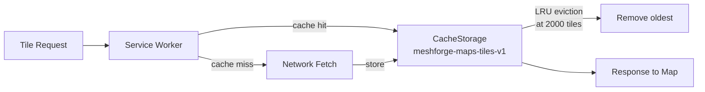

# meshforge-maps

> **Read the white paper:** [Building MeshForge Maps -- AI-Assisted Mesh Network Cartography](https://nursedude.substack.com/p/building-meshforge-maps)


A unified multi-source mesh network map that aggregates Meshtastic, Reticulum/RMAP, OpenHamClock propagation data, and AREDN into a single configurable Leaflet.js web map with live MQTT subscription, topology visualization, per-node health scoring, and offline tile caching.

**Runs standalone** or as a [MeshForge](https://github.com/Nursedude/meshforge) extension via plugin auto-discovery.

> This repo can be installed as an extension of [Nursedude/meshforge](https://github.com/Nursedude/meshforge). MeshForge discovers it automatically via `manifest.json` on launch. No MeshForge core dependency is required -- meshforge-maps runs independently with its own HTTP server.

## Features

### Data Collection
- **Multi-source data aggregation** -- collects node data from Meshtastic (MQTT/meshtasticd), Reticulum (rnstatus/RMAP/RCH), AREDN (sysinfo API), and OpenHamClock/NOAA propagation feeds
- **Live MQTT subscription** -- real-time Meshtastic node tracking via `mqtt.meshtastic.org` with protobuf decoding (POSITION_APP, NODEINFO_APP, TELEMETRY_APP, NEIGHBORINFO_APP)
- **Reticulum Community Hub (RCH) integration** -- telemetry proxy via FreeTAKTeam's FastAPI northbound REST API
- **AREDN mesh node discovery** -- per-node sysinfo API with LQM (Link Quality Manager) topology link extraction
- **Circuit breakers** -- per-source failure isolation with automatic recovery

### Visualization
- **Topology/link visualization** -- D3.js-powered mesh link overlay showing node-to-node connections with SNR-based coloring
- **Network-specific layer toggles** -- show/hide Meshtastic (green), Reticulum (purple), AREDN (orange) independently
- **Node health overlay** -- color-codes markers by composite health score (excellent/good/fair/poor/critical)
- **Space weather overlay** -- solar flux index, Kp index, solar wind speed, HF band condition assessment from NOAA SWPC
- **Propagation panel** -- VOACAP band predictions with reliability bars and SNR values, DE/DX station info, DX spots (from OpenHamClock)
- **Solar terminator** -- real-time day/night boundary overlay
- **Marker clustering** -- toggleable clustering for dense node areas
- **Node history** -- trajectory tracking and historical position playback

### Operations
- **Per-node health scoring** -- composite 0-100 score from battery, signal (SNR + hops), data freshness, connectivity reliability, and channel congestion
- **Performance profiling** -- collection cycle timing with per-source latency percentiles (p50/p90/p99), cache hit ratios
- **Node connectivity state machine** -- classifies nodes as new/stable/intermittent/offline based on heartbeat patterns
- **Config drift detection** -- tracks firmware and hardware changes across nodes
- **WebSocket real-time updates** -- event bus pushes position, telemetry, and topology changes to connected clients
- **Meshtastic API proxy** -- serves meshtasticd-compatible JSON endpoints for tool interoperability

### Infrastructure
- **Offline tile caching** -- service worker (sw-tiles.js) caches map tiles for offline/field use with LRU eviction
- **Configurable tile layers** -- CartoDB Dark, OpenStreetMap, OpenTopoMap, Esri Satellite, Esri Topo, Stadia Terrain
- **OpenHamClock auto-detection** -- tries port 3000 first (OpenHamClock), falls back to port 8080 (HamClock legacy)
- **Dark theme** -- matches MeshForge core UI (dark CartoDB + cyan accents)
- **Zero required dependencies** -- stdlib only; paho-mqtt and meshtastic are optional for live MQTT

## System Architecture



## Data Flow



## Node Health Scoring

Each node receives a composite health score (0-100) computed from available telemetry:

| Component | Weight | Inputs | Scoring |
|-----------|--------|--------|---------|
| **Battery** | 0-25 | Battery %, voltage | Linear: 20% = 0, 80% = full; 3.0V = 0, 3.7V = full |
| **Signal** | 0-25 | SNR (dB), hop count | Linear: -10dB = 0, 8dB = full; 7 hops = 0, 0 hops = full |
| **Freshness** | 0-20 | Last seen timestamp | Linear: 1hr ago = 0, 5min ago = full |
| **Reliability** | 0-15 | Connectivity state | Stable = 15, new = 10.5, intermittent = 4.5, offline = 0 |
| **Congestion** | 0-15 | Channel util %, TX air time | Inverted linear: 75% = 0, 25% = full |

Scores normalize to 0-100 based on available components only -- a node reporting only battery and freshness is scored out of 45 (25+20) and scaled proportionally. Not all mesh networks report all metrics.

| Score | Status | Color |
|-------|--------|-------|
| 80-100 | Excellent | Green |
| 60-79 | Good | Light green |
| 40-59 | Fair | Orange |
| 20-39 | Poor | Red |
| 0-19 | Critical | Dark red |

## Collector Priority



## Data Sources

| Source | Protocol | Data | Status |
|--------|----------|------|--------|
| **Meshtastic** | HTTP API (meshtasticd :4403) + Live MQTT + cache | Node positions, telemetry, battery, SNR, neighbors | Active |
| **Reticulum/RMAP** | rnstatus --json + RCH REST API + node cache | RNS interfaces, node types, transport info | Active |
| **OpenHamClock/NOAA** | OpenHamClock REST API (:3000) + NOAA SWPC APIs | VOACAP predictions, solar flux, Kp, band conditions, DX spots | Active |
| **AREDN** | sysinfo.json per-node API + LQM + cache | Node locations, firmware, link quality metrics | Active |

### Meshtastic (Live MQTT)

Real-time node tracking via the public Meshtastic MQTT broker at `mqtt.meshtastic.org`. Subscribes to `msh/#` topic tree and decodes `ServiceEnvelope` protobuf packets. Processes POSITION_APP, NODEINFO_APP, TELEMETRY_APP, and NEIGHBORINFO_APP for live map updates and topology links.

**Optional dependencies:** `paho-mqtt`, `meshtastic` (for protobuf). Falls back to JSON mode or cache file without them.

Reference: [meshtastic.org/docs/software/integrations/mqtt](https://meshtastic.org/docs/software/integrations/mqtt/) | [liamcottle/meshtastic-map](https://github.com/liamcottle/meshtastic-map)

### Reticulum / RMAP / RCH

Local RNS path table via `rnstatus -d --json` and [Reticulum Community Hub (RCH)](https://github.com/FreeTAKTeam/Reticulum-Telemetry-Hub) FastAPI endpoints. [RMAP.world](https://rmap.world) tracks ~306 Reticulum nodes globally. See [Discussion #743](https://github.com/markqvist/Reticulum/discussions/743).

### OpenHamClock / Propagation

Space weather from [NOAA SWPC](https://services.swpc.noaa.gov/) public JSON APIs. [OpenHamClock](https://github.com/accius/openhamclock) is the recommended propagation data source -- auto-detected on port 3000. Legacy HamClock (port 8080) is supported as a fallback but is no longer in active development.

### AREDN

Per-node sysinfo API at `http://<node>.local.mesh/a/sysinfo?lqm=1`. Requires mesh network access. LQM (Link Quality Manager) data provides topology links with SNR and quality metrics between nodes. Reference: [AREDN World Map](https://worldmap.arednmesh.org/) | [AREDN docs](https://docs.arednmesh.org/en/latest/arednHow-toGuides/devtools.html)

## Installation

### Standalone

```bash
git clone https://github.com/Nursedude/meshforge-maps.git
cd meshforge-maps
python -m src.main
# Opens http://127.0.0.1:8808
```

No external Python dependencies required for core functionality -- uses only stdlib (`http.server`, `json`, `urllib`, `subprocess`, `threading`).

### As MeshForge Extension

meshforge-maps can run as a [MeshForge](https://github.com/Nursedude/meshforge) extension. MeshForge discovers it automatically via `manifest.json` on launch -- no core dependency is required, and the maps server runs its own HTTP endpoint independently.

```bash
git clone https://github.com/Nursedude/meshforge-maps.git \
    ~/.config/meshforge/plugins/meshforge-maps/

# MeshForge will auto-discover via manifest.json on next launch
```

When running as a MeshForge extension:
- MeshForge discovers `manifest.json` at startup and loads the extension
- Maps launches its own HTTP server on port 8808 (configurable) + WebSocket on 8809
- Configuration is stored at `~/.config/meshforge/plugins/org.meshforge.extension.maps/settings.json`
- The extension operates independently -- MeshForge core is not required at runtime

### Optional: Live MQTT Support

```bash
pip install paho-mqtt meshtastic
# Enables real-time Meshtastic node tracking via mqtt.meshtastic.org
```

## Supported Hardware

MeshForge Maps runs on any platform with Python 3.9+. It is lightweight (stdlib only, in-memory storage) and well suited for single-board computers commonly used in mesh networking deployments.

### Raspberry Pi

| Model | SoC | RAM | Status | Notes |
|-------|-----|-----|--------|-------|
| **Raspberry Pi 5** | BCM2712 (Cortex-A76) | 2/4/8 GB | Recommended | Best performance for multi-source collection + MQTT |
| **Raspberry Pi 4 Model B** | BCM2711 (Cortex-A72) | 1/2/4/8 GB | Recommended | Most common deployment target |
| **Raspberry Pi 400** | BCM2711 (Cortex-A72) | 4 GB | Supported | Keyboard form factor, same SoC as Pi 4 |
| **Raspberry Pi 3 Model B+** | BCM2837B0 (Cortex-A53) | 1 GB | Supported | Adequate for single-source or cached operation |
| **Raspberry Pi 3 Model B** | BCM2837 (Cortex-A53) | 1 GB | Supported | Adequate for single-source or cached operation |
| **Raspberry Pi Zero 2 W** | RP3A0 (Cortex-A53) | 512 MB | Supported | Quad-core; suitable for headless/field deployments |
| **Raspberry Pi Zero W** | BCM2835 (ARM1176) | 512 MB | Limited | Single-core; functional but slow with live MQTT |

> **Minimum:** 512 MB RAM, ARMv7+ (armhf) or ARM64 (aarch64). Any Pi with a quad-core SoC handles all four collectors + live MQTT comfortably.

### Supported Operating Systems

| OS | Version | Python | Status |
|----|---------|--------|--------|
| **Raspberry Pi OS (Bookworm)** | Debian 12 based | 3.11 | Recommended |
| **Raspberry Pi OS (Bullseye)** | Debian 11 based | 3.9 | Supported |
| **Ubuntu Server** | 22.04 / 24.04 LTS (ARM64) | 3.10 / 3.12 | Supported |
| **DietPi** | Latest (Bookworm based) | 3.11 | Supported |
| **Armbian** | Bookworm / Jammy | 3.11 / 3.10 | Supported |
| **Debian** | 12 Bookworm+ (x86_64/ARM) | 3.11 | Supported |
| **macOS** | 13+ (Ventura) | 3.9+ (Homebrew/system) | Supported |
| **Windows** | 10/11 | 3.9+ (python.org) | Supported |

> **Not supported:** Raspberry Pi OS Legacy (Buster / Debian 10) ships Python 3.7 which is below the 3.9 minimum. Upgrade to Bookworm or install Python 3.9+ manually.

### Desktop / Server

MeshForge Maps also runs on any x86_64 or ARM64 machine with Python 3.9+. No OS-specific dependencies -- Linux, macOS, and Windows are all supported for development and deployment.

## Configuration

Settings stored at `~/.config/meshforge/plugins/org.meshforge.extension.maps/settings.json` (when running as MeshForge extension) or passed via config dict (standalone):

| Setting | Type | Default | Description |
|---------|------|---------|-------------|
| `default_tile_provider` | choice | `carto_dark` | Map tile style |
| `enable_meshtastic` | bool | `true` | Enable Meshtastic data source |
| `enable_reticulum` | bool | `true` | Enable Reticulum/RMAP source |
| `enable_hamclock` | bool | `true` | Enable propagation data (OpenHamClock/NOAA) |
| `enable_aredn` | bool | `true` | Enable AREDN source |
| `map_center_lat` | number | `20.0` | Default map center latitude |
| `map_center_lon` | number | `-100.0` | Default map center longitude |
| `map_default_zoom` | number | `4` | Default zoom level |
| `cache_ttl_minutes` | number | `15` | Data cache lifetime |
| `http_port` | number | `8808` | Map server HTTP port |
| `hamclock_host` | string | `localhost` | OpenHamClock/HamClock host |
| `openhamclock_port` | number | `3000` | OpenHamClock port (tried first) |
| `hamclock_port` | number | `8080` | HamClock legacy port (fallback) |

## API Endpoints

### Node Data

| Endpoint | Method | Description |
|----------|--------|-------------|
| `/` | GET | Map HTML page |
| `/api/nodes/geojson` | GET | All nodes (aggregated GeoJSON FeatureCollection) |
| `/api/nodes/<source>` | GET | Single source GeoJSON (meshtastic, reticulum, aredn) |
| `/api/nodes/<id>/trajectory` | GET | Node position history (GeoJSON LineString) |
| `/api/nodes/<id>/history` | GET | Node observation history (timestamps, positions) |
| `/api/nodes/<id>/health` | GET | Per-node health score with component breakdown |

### Topology & Overlays

| Endpoint | Method | Description |
|----------|--------|-------------|
| `/api/topology` | GET | Mesh link/neighbor data (JSON) |
| `/api/topology/geojson` | GET | Topology as GeoJSON (SNR-colored LineStrings) |
| `/api/overlay` | GET | Space weather + solar terminator data |
| `/api/hamclock` | GET | OpenHamClock/NOAA propagation (VOACAP, DX spots, band conditions) |

### Health & Monitoring

| Endpoint | Method | Description |
|----------|--------|-------------|
| `/api/node-health` | GET | Health scores for all nodes |
| `/api/node-health/summary` | GET | Aggregate health statistics (avg, min, max, status counts) |
| `/api/health` | GET | System health score (0-100) with freshness, source, circuit breaker breakdown |
| `/api/status` | GET | Server status (uptime, data age, MQTT, WebSocket, event bus stats) |
| `/api/perf` | GET | Performance profiling (per-source latency p50/p90/p99, cache hit ratio) |
| `/api/node-states` | GET | Node connectivity states (new/stable/intermittent/offline) |
| `/api/node-states/summary` | GET | Node state summary (counts by state) |
| `/api/config-drift` | GET | Configuration drift events (firmware/hardware changes) |
| `/api/mqtt/stats` | GET | MQTT subscriber statistics |

### Configuration

| Endpoint | Method | Description |
|----------|--------|-------------|
| `/api/config` | GET | Current configuration |
| `/api/tile-providers` | GET | Available tile layers |
| `/api/sources` | GET | Enabled data sources |
| `/api/core-health` | GET | Cross-process health state (shared memory) |
| `/api/proxy/stats` | GET | Meshtastic API proxy statistics |

## Offline Tile Caching

The service worker (`sw-tiles.js`) provides offline map tile access:



- **Tiles:** Cache-first strategy (instant offline response)
- **API:** Network-first with cache fallback
- **CDN assets:** Cache-first (Leaflet, D3, MarkerCluster)
- **Max cache:** 2000 tiles with LRU eviction

## Tile Providers

| Key | Name | Best For |
|-----|------|----------|
| `carto_dark` | CartoDB Dark Matter | NOC / night operations |
| `osm_standard` | OpenStreetMap | General reference |
| `osm_topo` | OpenTopoMap | Terrain / elevation planning |
| `esri_satellite` | Esri Satellite | RF line-of-sight / terrain |
| `esri_topo` | Esri Topographic | Field operations |
| `stadia_terrain` | Stadia Terrain | Landscape overview |

## Testing

```bash
pytest tests/ -v
# 670 tests covering:
#   - Base helpers, config, coordinate validation
#   - All 4 collectors (Meshtastic, Reticulum, HamClock, AREDN)
#   - Aggregator deduplication, MQTT node store, topology links
#   - Map server startup/port fallback, plugin lifecycle/events
#   - Circuit breaker, reconnect strategy, event bus
#   - WebSocket server, real-time pipeline
#   - OpenHamClock auto-detection and port priority
#   - Per-node health scoring (all 5 components, normalization, cache)
#   - Performance profiling (timing, percentiles, memory)
#   - AREDN hardening (network errors, malformed responses, cache, LQM edges)
#   - Node history DB, shared health state, topology GeoJSON
#   - Config drift detection, node state machine
```

## Roadmap

### Near-term

- **Alerting & notifications** -- threshold-based alerts for node offline, battery low, congestion spikes, and connectivity state transitions. Delivery via webhook, MQTT publish, and optional email integration. Configurable per-node and per-network alert rules.

- **Historical analytics** -- time-series dashboards built on the existing NodeHistoryDB (SQLite). Coverage heatmaps showing node density over time, uptime SLA reports, and signal quality trend charts. Export to CSV for external analysis.

### Medium-term

- **Multi-instance federation** -- peer multiple MeshForge Maps instances across geographies for distributed NOC views. Lightweight gossip protocol over MQTT or HTTP for node and health state synchronization. Aggregate topology view spanning federated instances.

- **Mobile / PWA** -- Progressive Web App with push notifications for critical health alerts, offline-first data access, responsive touch UI optimized for field operations on tablets and phones. Service worker already provides tile caching foundation.

### Ongoing

- Collector hardening and edge case coverage across all data sources
- Performance optimization for large meshes (1000+ nodes)
- Community-contributed tile providers and overlay plugins

## Contributing

Follow [MeshForge contributing guidelines](https://github.com/Nursedude/meshforge/blob/main/CONTRIBUTING.md):

- Python 3.9+, PEP 8, type hints encouraged
- Commit convention: `feat:`, `fix:`, `docs:`, `refactor:`, `test:`
- No `shell=True` in subprocess, no bare `except:`, no `os.system()`
- Validate all user inputs, HTML-escape all output
- Network bindings default to `127.0.0.1`
- PR with summary, changes list, and testing checklist

## License

[GPL-3.0](LICENSE) -- same as MeshForge core.

## Related Projects

- [MeshForge](https://github.com/Nursedude/meshforge) -- Turnkey Mesh Network Operations Center
- [OpenHamClock](https://github.com/accius/openhamclock) -- Ham radio propagation dashboard (recommended)
- [RMAP.world](https://rmap.world) -- Reticulum Network World Map
- [Reticulum Community Hub](https://github.com/FreeTAKTeam/Reticulum-Telemetry-Hub) -- RCH FastAPI telemetry hub
- [meshtastic-map](https://github.com/liamcottle/meshtastic-map) -- Meshtastic MQTT map (reference implementation)
- [AREDN World Map](https://worldmap.arednmesh.org/) -- Global AREDN node visualization
- [AREDN](https://www.arednmesh.org/) -- Amateur Radio Emergency Data Network
- [Meshtastic](https://meshtastic.org/) -- LoRa mesh networking platform
- [Reticulum](https://reticulum.network/) -- Cryptographic mesh networking stack
