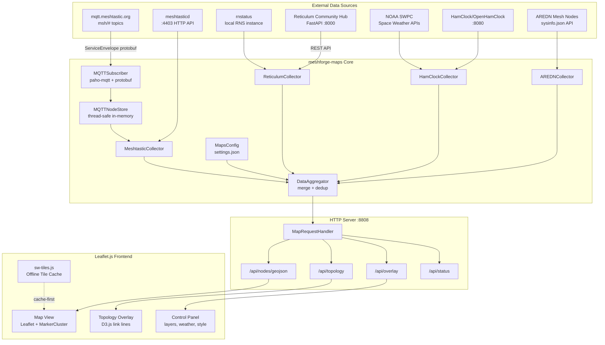
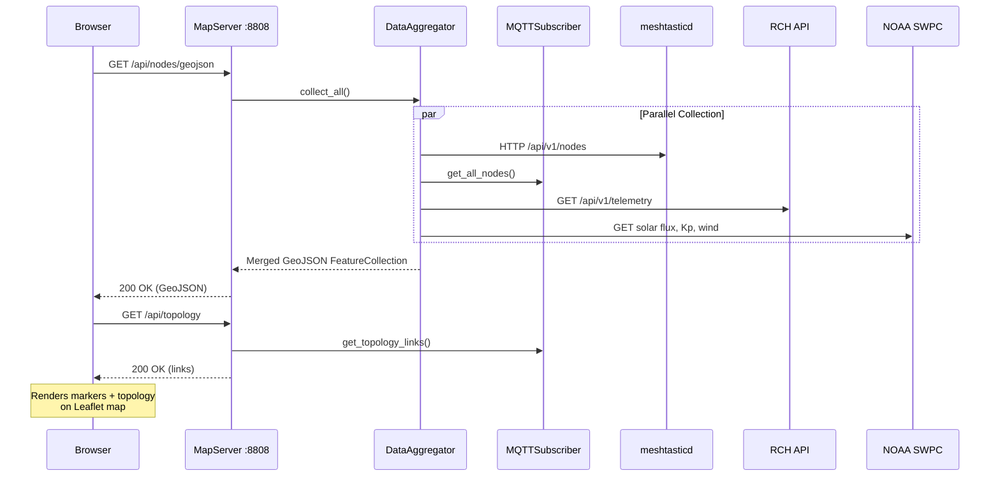
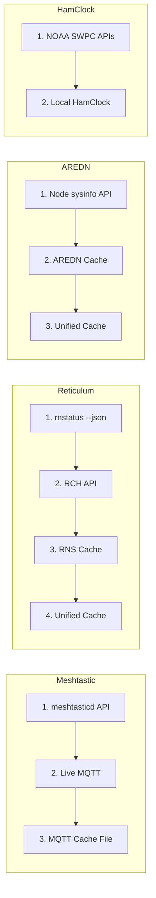
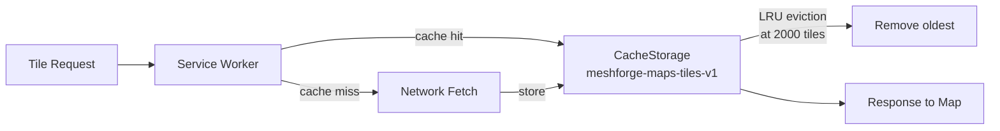

# meshforge-maps

> **Read the white paper:** [Building MeshForge Maps -- AI-Assisted Mesh Network Cartography](https://nursedude.substack.com/p/building-meshforge-maps)


**Maps extension for [MeshForge](https://github.com/Nursedude/meshforge)** -- a unified multi-source mesh network map that aggregates Meshtastic, Reticulum/RMAP, HamClock propagation data, and AREDN into a single configurable Leaflet.js web map with live MQTT subscription, topology visualization, and offline tile caching.

> This repo is an extension of [Nursedude/meshforge](https://github.com/Nursedude/meshforge) -- env updates will come from that repo.

## Features

- **Multi-source data aggregation** -- collects node data from Meshtastic (MQTT/meshtasticd), Reticulum (rnstatus/RMAP/RCH), AREDN (sysinfo API), and HamClock/NOAA propagation feeds
- **Live MQTT subscription** -- real-time Meshtastic node tracking via `mqtt.meshtastic.org` with protobuf decoding (POSITION_APP, NODEINFO_APP, TELEMETRY_APP, NEIGHBORINFO_APP)
- **Reticulum Community Hub (RCH) integration** -- telemetry proxy via FreeTAKTeam's FastAPI northbound REST API
- **Topology/link visualization** -- D3.js-powered mesh link overlay showing node-to-node connections with SNR-based coloring
- **Offline tile caching** -- service worker (sw-tiles.js) caches map tiles for offline/field use with LRU eviction
- **Configurable tile layers** -- CartoDB Dark, OpenStreetMap, OpenTopoMap, Esri Satellite, Esri Topo, Stadia Terrain
- **Network-specific layer toggles** -- show/hide Meshtastic (green), Reticulum (purple), AREDN (orange) independently
- **Space weather overlay** -- solar flux index, Kp index, solar wind speed, HF band condition assessment from NOAA SWPC
- **Solar terminator** -- real-time day/night boundary overlay
- **Marker clustering** -- toggleable clustering for dense node areas
- **Dark theme** -- matches MeshForge core UI (dark CartoDB + cyan accents)
- **Standalone mode** -- runs independently or as a MeshForge plugin
- **Zero required dependencies** -- stdlib only; paho-mqtt and meshtastic are optional for live MQTT

## System Architecture



## Data Flow



## Collector Priority



## Data Sources

| Source | Protocol | Data | Status |
|--------|----------|------|--------|
| **Meshtastic** | HTTP API (meshtasticd :4403) + Live MQTT + cache | Node positions, telemetry, battery, SNR, neighbors | Active |
| **Reticulum/RMAP** | rnstatus --json + RCH REST API + node cache | RNS interfaces, node types, transport info | Active |
| **HamClock/NOAA** | NOAA SWPC REST APIs + local HamClock | Solar flux, Kp index, band conditions, terminator | Active |
| **AREDN** | sysinfo.json per-node API + cache | Node locations, firmware, link quality | Active |

### Meshtastic (Live MQTT)

Real-time node tracking via the public Meshtastic MQTT broker at `mqtt.meshtastic.org`. Subscribes to `msh/#` topic tree and decodes `ServiceEnvelope` protobuf packets. Processes POSITION_APP, NODEINFO_APP, TELEMETRY_APP, and NEIGHBORINFO_APP for live map updates and topology links.

**Optional dependencies:** `paho-mqtt`, `meshtastic` (for protobuf). Falls back to JSON mode or cache file without them.

Reference: [meshtastic.org/docs/software/integrations/mqtt](https://meshtastic.org/docs/software/integrations/mqtt/) | [liamcottle/meshtastic-map](https://github.com/liamcottle/meshtastic-map)

### Reticulum / RMAP / RCH

Local RNS path table via `rnstatus -d --json` and [Reticulum Community Hub (RCH)](https://github.com/FreeTAKTeam/Reticulum-Telemetry-Hub) FastAPI endpoints. [RMAP.world](https://rmap.world) tracks ~306 Reticulum nodes globally. See [Discussion #743](https://github.com/markqvist/Reticulum/discussions/743).

### HamClock / Propagation

Space weather from [NOAA SWPC](https://services.swpc.noaa.gov/) public JSON APIs. Optional local HamClock instance on port 8080. [OpenHamClock](https://github.com/accius/openhamclock) is the recommended successor.

### AREDN

Per-node sysinfo API at `http://<node>.local.mesh/a/sysinfo?lqm=1`. Requires mesh network access. Reference: [AREDN World Map](https://worldmap.arednmesh.org/) | [AREDN docs](https://docs.arednmesh.org/en/latest/arednHow-toGuides/devtools.html)

## Installation

### As MeshForge Plugin
```bash
git clone https://github.com/Nursedude/meshforge-maps.git \
    ~/.config/meshforge/plugins/meshforge-maps/

# MeshForge will auto-discover via manifest.json on next launch
```

### Standalone
```bash
git clone https://github.com/Nursedude/meshforge-maps.git
cd meshforge-maps
python -m src.main
# Opens http://127.0.0.1:8808
```

### Optional: Live MQTT Support
```bash
pip install paho-mqtt meshtastic
# Enables real-time Meshtastic node tracking via mqtt.meshtastic.org
```

No external Python dependencies required for core functionality -- uses only stdlib (`http.server`, `json`, `urllib`, `subprocess`, `threading`).

## Supported Hardware

MeshForge Maps runs on any platform with Python 3.9+. It is lightweight (stdlib only, in-memory storage) and well suited for single-board computers commonly used in mesh networking deployments.

### Raspberry Pi

| Model | SoC | RAM | Status | Notes |
|-------|-----|-----|--------|-------|
| **Raspberry Pi 5** | BCM2712 (Cortex-A76) | 2/4/8 GB | Recommended | Best performance for multi-source collection + MQTT |
| **Raspberry Pi 4 Model B** | BCM2711 (Cortex-A72) | 1/2/4/8 GB | Recommended | Most common deployment target |
| **Raspberry Pi 400** | BCM2711 (Cortex-A72) | 4 GB | Supported | Keyboard form factor, same SoC as Pi 4 |
| **Raspberry Pi 3 Model B+** | BCM2837B0 (Cortex-A53) | 1 GB | Supported | Adequate for single-source or cached operation |
| **Raspberry Pi 3 Model B** | BCM2837 (Cortex-A53) | 1 GB | Supported | Adequate for single-source or cached operation |
| **Raspberry Pi Zero 2 W** | RP3A0 (Cortex-A53) | 512 MB | Supported | Quad-core; suitable for headless/field deployments |
| **Raspberry Pi Zero W** | BCM2835 (ARM1176) | 512 MB | Limited | Single-core; functional but slow with live MQTT |

> **Minimum:** 512 MB RAM, ARMv7+ (armhf) or ARM64 (aarch64). Any Pi with a quad-core SoC handles all four collectors + live MQTT comfortably.

### Supported Operating Systems

| OS | Version | Python | Status |
|----|---------|--------|--------|
| **Raspberry Pi OS (Bookworm)** | Debian 12 based | 3.11 | Recommended |
| **Raspberry Pi OS (Bullseye)** | Debian 11 based | 3.9 | Supported |
| **Ubuntu Server** | 22.04 / 24.04 LTS (ARM64) | 3.10 / 3.12 | Supported |
| **DietPi** | Latest (Bookworm based) | 3.11 | Supported |
| **Armbian** | Bookworm / Jammy | 3.11 / 3.10 | Supported |
| **Debian** | 12 Bookworm+ (x86_64/ARM) | 3.11 | Supported |
| **macOS** | 13+ (Ventura) | 3.9+ (Homebrew/system) | Supported |
| **Windows** | 10/11 | 3.9+ (python.org) | Supported |

> **Not supported:** Raspberry Pi OS Legacy (Buster / Debian 10) ships Python 3.7 which is below the 3.9 minimum. Upgrade to Bookworm or install Python 3.9+ manually.

### Desktop / Server

MeshForge Maps also runs on any x86_64 or ARM64 machine with Python 3.9+. No OS-specific dependencies -- Linux, macOS, and Windows are all supported for development and deployment.

## Configuration

Settings stored at `~/.config/meshforge/plugins/org.meshforge.extension.maps/settings.json`:

| Setting | Type | Default | Description |
|---------|------|---------|-------------|
| `default_tile_provider` | choice | `carto_dark` | Map tile style |
| `enable_meshtastic` | bool | `true` | Enable Meshtastic data source |
| `enable_reticulum` | bool | `true` | Enable Reticulum/RMAP source |
| `enable_hamclock` | bool | `true` | Enable HamClock/propagation |
| `enable_aredn` | bool | `true` | Enable AREDN source |
| `map_center_lat` | number | `20.0` | Default map center latitude |
| `map_center_lon` | number | `-100.0` | Default map center longitude |
| `map_default_zoom` | number | `4` | Default zoom level |
| `cache_ttl_minutes` | number | `15` | Data cache lifetime |
| `http_port` | number | `8808` | Map server HTTP port |

## API Endpoints

| Endpoint | Method | Description |
|----------|--------|-------------|
| `/` | GET | Map HTML page |
| `/api/nodes/geojson` | GET | All nodes (aggregated GeoJSON) |
| `/api/nodes/<source>` | GET | Single source GeoJSON |
| `/api/topology` | GET | Mesh link/neighbor data for D3.js |
| `/api/config` | GET | Current configuration |
| `/api/tile-providers` | GET | Available tile layers |
| `/api/sources` | GET | Enabled data sources |
| `/api/overlay` | GET | Space weather + terminator data |
| `/api/status` | GET | Server health + MQTT status |

## Offline Tile Caching

The service worker (`sw-tiles.js`) provides offline map tile access:



- **Tiles:** Cache-first strategy (instant offline response)
- **API:** Network-first with cache fallback
- **CDN assets:** Cache-first (Leaflet, D3, MarkerCluster)
- **Max cache:** 2000 tiles with LRU eviction

## Tile Providers

| Key | Name | Best For |
|-----|------|----------|
| `carto_dark` | CartoDB Dark Matter | NOC / night operations |
| `osm_standard` | OpenStreetMap | General reference |
| `osm_topo` | OpenTopoMap | Terrain / elevation planning |
| `esri_satellite` | Esri Satellite | RF line-of-sight / terrain |
| `esri_topo` | Esri Topographic | Field operations |
| `stadia_terrain` | Stadia Terrain | Landscape overview |

## Testing

```bash
python -m pytest tests/ -v
# 348 tests covering: base helpers, config, all 4 collectors,
# aggregator deduplication, MQTT node store, topology links,
# map server startup/port fallback, plugin lifecycle/events,
# circuit breaker, reconnect strategy, event bus, WebSocket server,
# real-time pipeline, OpenHamClock detection, health endpoint,
# node history DB, shared health state, topology GeoJSON, AREDN LQM
```

## Contributing

Follow [MeshForge contributing guidelines](https://github.com/Nursedude/meshforge/blob/main/CONTRIBUTING.md):

- Python 3.9+, PEP 8, type hints encouraged
- Commit convention: `feat:`, `fix:`, `docs:`, `refactor:`, `test:`
- No `shell=True` in subprocess, no bare `except:`, no `os.system()`
- Validate all user inputs, HTML-escape all output
- Network bindings default to `127.0.0.1`
- PR with summary, changes list, and testing checklist

## License

[GPL-3.0](LICENSE) -- same as MeshForge core.

## Related Projects

- [MeshForge](https://github.com/Nursedude/meshforge) -- Turnkey Mesh Network Operations Center
- [RMAP.world](https://rmap.world) -- Reticulum Network World Map
- [Reticulum Community Hub](https://github.com/FreeTAKTeam/Reticulum-Telemetry-Hub) -- RCH FastAPI telemetry hub
- [meshtastic-map](https://github.com/liamcottle/meshtastic-map) -- Meshtastic MQTT map (reference implementation)
- [AREDN World Map](https://worldmap.arednmesh.org/) -- Global AREDN node visualization
- [OpenHamClock](https://github.com/accius/openhamclock) -- Ham radio dashboard (HamClock successor)
- [AREDN](https://www.arednmesh.org/) -- Amateur Radio Emergency Data Network
- [Meshtastic](https://meshtastic.org/) -- LoRa mesh networking platform
- [Reticulum](https://reticulum.network/) -- Cryptographic mesh networking stack
