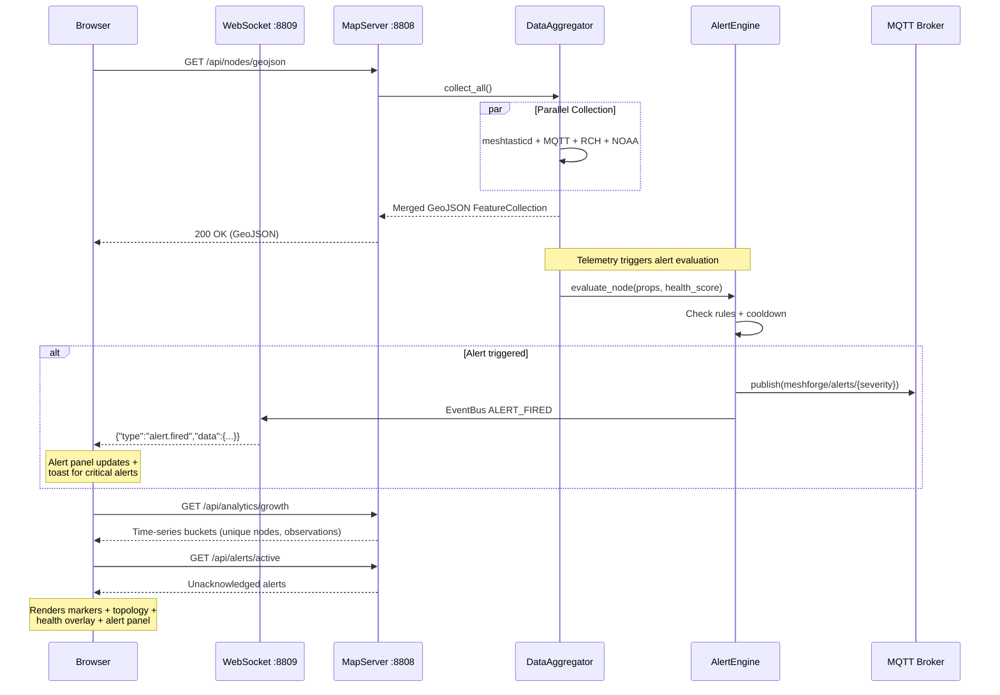
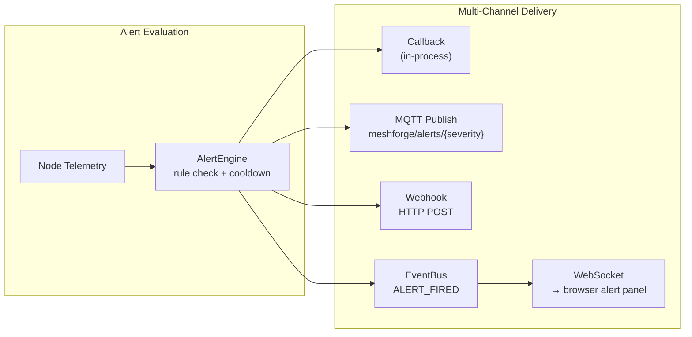
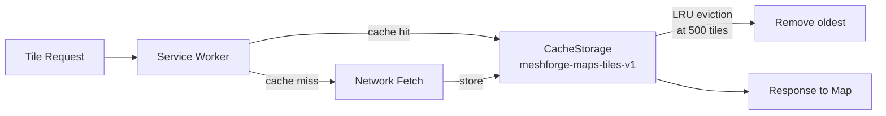

# meshforge-maps

Visualization plugin for the [MeshForge ecosystem](https://github.com/Nursedude/meshforge/blob/main/.claude/foundations/meshforge_ecosystem.md)

> **Read the white paper:** [Building MeshForge Maps -- AI-Assisted Mesh Network Cartography](https://nursedude.substack.com/p/building-meshforge-maps)
>
> **More field notes:** [`docs/substack/`](docs/substack/) -- debugging post-mortems and collaboration notes from this project.


A unified multi-source mesh network map that aggregates Meshtastic, Reticulum/RMAP, OpenHamClock propagation data, AREDN, and MeshCore into a single configurable Leaflet.js web map with live MQTT subscription, topology visualization, per-node health scoring, threshold-based alerting, historical analytics, and offline tile caching.

**Runs standalone** or as a [MeshForge](https://github.com/Nursedude/meshforge) extension via plugin auto-discovery.

> This repo can be installed as an extension of [Nursedude/meshforge](https://github.com/Nursedude/meshforge). MeshForge discovers it automatically via `manifest.json` on launch. No MeshForge core dependency is required -- meshforge-maps runs independently with its own HTTP server.

> **Beta notice:** This project is under active development. While core functionality (map rendering, data collection, REST API) is working, many features — particularly real-time MQTT ingestion, alerting delivery, TUI dashboard, and multi-source topology — have not been extensively tested against live production meshes. Community testing and bug reports are welcome. See [Testing Status](#testing-status) for details.

## How It Works

MeshForge Maps runs a lightweight HTTP server (default `:8808`) alongside a WebSocket server (`:8809`) that together power two interfaces: a **Leaflet.js web map** in your browser and an optional **curses-based terminal dashboard** (`--tui`).

Works with or without local radio hardware -- each collector falls back through a priority chain (local API → MQTT → cache), so headless/MQTT-only deployments get the same map experience. See [Pi Deployment](#pi-deployment-headless--no-radio) for details.

Behind the scenes, four **collectors** poll their respective data sources on a 5-second cycle -- Meshtastic nodes, Reticulum/RMAP nodes, AREDN mesh nodes, and HF propagation/space weather. A **data aggregator** merges and deduplicates the results into a unified GeoJSON dataset. That dataset feeds the REST API, which the web map and TUI consume.

Real-time updates flow through an **event bus**: as new positions, telemetry, or topology changes arrive, they're broadcast over WebSocket to connected browsers and pushed to the TUI's live event stream. An **alert engine** evaluates node health against configurable threshold rules and delivers alerts via MQTT, webhooks, and the browser alert panel simultaneously.

**Quick start:**

```bash
python -m src.main              # web map only → http://127.0.0.1:8808
python -m src.main --tui        # web map + terminal dashboard
python -m src.main --tui-only   # TUI client (connect to existing server)
python -m src.main --setup      # interactive setup wizard
```

## Features

### Data Collection
- **Multi-source aggregation** -- Meshtastic, Reticulum/RMAP, AREDN, MeshCore, and OpenHamClock/NOAA (see [Data Sources](#data-sources) for protocol details)
- **Live MQTT subscription** -- real-time Meshtastic node tracking with AES-CTR decryption and protobuf decoding
- **Public map sources** -- meshmap.net (~300+ Meshtastic nodes), RMAP.world (~160 Reticulum nodes), AREDN Worldmap (~2500 nodes), MeshCore (~30K nodes) fetched automatically
- **Circuit breakers** -- per-source failure isolation with automatic recovery

### Visualization
- **Region presets** -- one-click templates (Hawaii, West Coast, US, World) that bundle map center, zoom, and MQTT topic. First-run picker appears before map loads; persists as default
- **Topology/link visualization** -- D3.js-powered mesh link overlay showing node-to-node connections with SNR-based coloring
- **Network-specific layer toggles** -- show/hide Meshtastic (green), Reticulum (purple), AREDN (orange), MeshCore (cyan) independently
- **Node health overlay** -- color-codes markers by composite health score (excellent/good/fair/poor/critical)
- **Space weather overlay** -- solar flux index, Kp index, solar wind speed, HF band condition assessment from NOAA SWPC
- **Propagation panel** -- VOACAP band predictions with reliability bars and SNR values, DE/DX station info, DX spots (from OpenHamClock)
- **Solar terminator** -- real-time day/night boundary overlay
- **Marker clustering** -- toggleable clustering for dense node areas
- **Node history** -- trajectory tracking and historical position playback
- **Auto-refresh on tab return** -- visibility change handler forces full data refresh when returning to the map tab after background/sleep, preventing stale display

### Terminal Dashboard (TUI)

A full curses-based terminal interface launched with `--tui` (alongside the server) or `--tui-only` (connect to an existing server). Seven tabbed screens, switchable with `1`-`7` or arrow keys:

| Tab | Key | What It Shows |
|-----|-----|--------------|
| **Dashboard** | `1` | Server status, source health, node counts, alert summary, analytics overview |
| **Nodes** | `2` | Sortable/searchable node table with drill-down to health breakdown and history |
| **Alerts** | `3` | Live alert feed with severity coloring, active/history sections, filtering |
| **Propagation** | `4` | HF band predictions (VOACAP), space weather (SFI, Kp), DX spots |
| **Topology** | `5` | ASCII mesh topology with SNR-colored links per network |
| **Events** | `6` | Live WebSocket event stream with pause (`p`), filter (`f`), search (`/`) |
| **System** | `7` | Dependency versions, Meshtastic API status, config info, upgrade commands |

**Keyboard:** `q` quit, `r` refresh, `j`/`k` scroll, `/` search, `s` sort, `Enter` drill-down, `Esc` back.

### Alerting & Notifications
- **Threshold-based alert engine** -- configurable rules with per-node cooldown, multi-channel delivery (MQTT, webhooks, EventBus, browser), and real-time alert panel with toast notifications. See [Alert Delivery](#alert-delivery) for details.

### Historical Analytics
- **Network growth time-series** -- unique nodes per time bucket showing mesh expansion over time
- **Activity heatmap** -- observation counts by hour of day (0-23) with peak activity detection
- **Node activity ranking** -- most active nodes ranked by observation count with uptime duration
- **Network summary** -- per-network breakdown of nodes and observations with averages
- **Alert trend aggregation** -- alerts bucketed over time with per-severity counts (critical/warning/info)

### Operations
- **Per-node health scoring** -- composite 0-100 score (see [Node Health Scoring](#node-health-scoring))
- **Performance profiling** -- collection cycle timing with per-source latency percentiles (p50/p90/p99), cache hit ratios
- **Node connectivity state machine** -- classifies nodes as new/stable/intermittent/offline based on heartbeat patterns
- **Config drift detection** -- tracks firmware and hardware changes across nodes
- **WebSocket real-time updates** -- event bus pushes position, telemetry, topology, and alert events to connected clients with staleness detection and automatic reconnect
- **Last-updated timestamp** -- header badge shows time of last successful data refresh
- **Meshtastic API proxy** -- serves meshtasticd-compatible JSON endpoints for tool interoperability

### Infrastructure
- **Offline tile caching** -- service worker (sw-tiles.js) caches map tiles for offline/field use with LRU eviction
- **Configurable tile layers** -- CartoDB Dark, OpenStreetMap, OpenTopoMap, Esri Satellite, Esri Topo, Stadia Terrain
- **OpenHamClock auto-detection** -- tries port 3000 first (OpenHamClock), falls back to port 8080 (HamClock legacy)
- **Dark theme** -- matches MeshForge core UI (dark CartoDB + cyan accents)
- **Zero required dependencies** -- stdlib only; paho-mqtt and meshtastic are optional for live MQTT
- **Docker support** -- single-container deployment with env var configuration
- **Admin authentication** -- API key protects settings; public read-only map access
- **Interactive setup wizard** -- `--setup` flag for first-run terminal configuration

## System Architecture


```mermaid
graph TB
    subgraph External["External Data Sources"]
        MQTT["mqtt.meshtastic.org<br/>msh/# topics"]
        MESHTD["meshtasticd<br/>:4403 HTTP API"]
        MESHMAP["meshmap.net<br/>nodes.json API"]
        RNS["rnstatus<br/>local RNS instance"]
        RCH["Reticulum Community Hub<br/>FastAPI :8000"]
        NOAA["NOAA SWPC<br/>Space Weather APIs"]
        HAMCLK["OpenHamClock :3000<br/>HamClock :8080 (legacy)"]
        AREDN_NODES["AREDN Mesh Nodes<br/>sysinfo.json API"]
        MESHCORE["map.meshcore.dev<br/>~30K nodes API"]
    end

    subgraph Core["meshforge-maps Core"]
        MQTTSUB["MQTTSubscriber<br/>paho-mqtt + protobuf"]
        STORE["MQTTNodeStore<br/>thread-safe in-memory"]
        MC["MeshtasticCollector"]
        RC["ReticulumCollector"]
        HC["HamClockCollector"]
        AC["AREDNCollector"]
        MCC["MeshCoreCollector"]
        AGG["DataAggregator<br/>merge + dedup + timing"]
        CFG["MapsConfig<br/>settings.json"]
        CB["CircuitBreakerRegistry"]
        PERF["PerfMonitor<br/>latency + cache stats"]
    end

    subgraph Operations["Operations Layer"]
        HEALTH["NodeHealthScorer<br/>0-100 composite score"]
        STATE["NodeStateTracker<br/>new/stable/intermittent/offline"]
        DRIFT["ConfigDriftDetector"]
        HISTORY["NodeHistoryDB<br/>SQLite trajectory"]
        EBUS["EventBus<br/>pub/sub decoupling"]
        ALERT["AlertEngine<br/>threshold rules + cooldown"]
        ANALYTICS["HistoricalAnalytics<br/>time-series aggregation"]
    end

    subgraph Server["HTTP Server :8808 + WebSocket :8809"]
        HANDLER["MapRequestHandler"]
        API_GEO["/api/nodes/geojson"]
        API_TOPO["/api/topology/geojson"]
        API_HEALTH["/api/node-health"]
        API_ALERT["/api/alerts"]
        API_ANALYTICS["/api/analytics/*"]
        API_STAT["/api/status"]
        WS["MapWebSocketServer<br/>real-time broadcast"]
    end

    subgraph Frontend["Leaflet.js Frontend"]
        MAP["Map View<br/>Leaflet + MarkerCluster"]
        TOPO["Topology Overlay<br/>SNR-colored links"]
        HOVR["Health Overlay<br/>score-colored markers"]
        ALERTPANEL["Alert Panel<br/>live alerts + badge"]
        SW["sw-tiles.js<br/>Offline Tile Cache"]
        PANEL["Control Panel<br/>layers, weather, health, alerts"]
    end

    MQTT -->|ServiceEnvelope protobuf| MQTTSUB
    MQTTSUB --> STORE
    STORE --> MC
    MESHTD --> MC
    RNS --> RC
    RCH -->|REST API| RC
    NOAA --> HC
    HAMCLK --> HC
    AREDN_NODES --> AC

    MC --> AGG
    RC --> AGG
    HC --> AGG
    AC --> AGG
    CFG --> AGG
    CB --> AGG
    PERF --> AGG

    AGG --> EBUS
    EBUS --> STATE
    EBUS --> DRIFT
    EBUS --> HISTORY
    EBUS --> ALERT
    EBUS --> WS
    ALERT -->|MQTT publish| MQTT
    ALERT -->|ALERT_FIRED| EBUS

    HISTORY --> ANALYTICS
    ALERT --> ANALYTICS

    AGG --> HANDLER
    HANDLER --> API_GEO
    HANDLER --> API_TOPO
    HANDLER --> API_HEALTH
    HANDLER --> API_ALERT
    HANDLER --> API_ANALYTICS
    HANDLER --> API_STAT
    HEALTH --> API_HEALTH

    API_GEO --> MAP
    API_TOPO --> TOPO
    API_HEALTH --> HOVR
    API_ALERT --> ALERTPANEL
    WS -->|alert.fired| ALERTPANEL
    WS --> MAP
    SW -.->|cache-first| MAP
```

## Data Flow


```mermaid
sequenceDiagram
    participant Browser
    participant WS as WebSocket :8809
    participant Server as MapServer :8808
    participant Agg as DataAggregator
    participant Alert as AlertEngine
    participant MQTT as MQTT Broker

    Browser->>Server: GET /api/nodes/geojson
    Server->>Agg: collect_all()

    par Parallel Collection
        Agg->>Agg: meshtasticd + MQTT + RCH + NOAA
    end

    Agg-->>Server: Merged GeoJSON FeatureCollection
    Server-->>Browser: 200 OK (GeoJSON)

    Note over Agg,Alert: Telemetry triggers alert evaluation

    Agg->>Alert: evaluate_node(props, health_score)
    Alert->>Alert: Check rules + cooldown
    alt Alert triggered
        Alert->>MQTT: publish(meshforge/alerts/{severity})
        Alert->>WS: EventBus ALERT_FIRED
        WS-->>Browser: {"type":"alert.fired","data":{...}}
        Note over Browser: Alert panel updates +<br/>toast for critical alerts
    end

    Browser->>Server: GET /api/analytics/growth
    Server-->>Browser: Time-series buckets (unique nodes, observations)

    Browser->>Server: GET /api/alerts/active
    Server-->>Browser: Unacknowledged alerts

    Note over Browser: Renders markers + topology +<br/>health overlay + alert panel
```

## Node Health Scoring

Each node receives a composite health score (0-100) computed from available telemetry:

| Component | Weight | Inputs | Scoring |
|-----------|--------|--------|---------|
| **Battery** | 0-25 | Battery %, voltage | Linear: 20% = 0, 80% = full; 3.0V = 0, 3.7V = full |
| **Signal** | 0-25 | SNR (dB), hop count | Linear: -10dB = 0, 8dB = full; 7 hops = 0, 0 hops = full |
| **Freshness** | 0-20 | Last seen timestamp | Linear: 1hr ago = 0, 5min ago = full |
| **Reliability** | 0-15 | Connectivity state | Stable = 15, new = 10.5, intermittent = 4.5, offline = 0 |
| **Congestion** | 0-15 | Channel util %, TX air time | Inverted linear: 75% = 0, 25% = full |

Scores normalize to 0-100 based on available components only -- a node reporting only battery and freshness is scored out of 45 (25+20) and scaled proportionally. Not all mesh networks report all metrics.

| Score | Status | Color |
|-------|--------|-------|
| 80-100 | Excellent | Green |
| 60-79 | Good | Light green |
| 40-59 | Fair | Orange |
| 20-39 | Poor | Red |
| 0-19 | Critical | Dark red |

## Alert Delivery

Alerts are generated by the threshold-based alert engine when node telemetry crosses configured rules. Each alert is delivered through multiple channels simultaneously:


```mermaid
flowchart LR
    subgraph Trigger["Alert Evaluation"]
        TEL["Node Telemetry"] --> ENGINE["AlertEngine<br/>rule check + cooldown"]
    end
    subgraph Delivery["Multi-Channel Delivery"]
        ENGINE --> CB["Callback<br/>(in-process)"]
        ENGINE --> MQ["MQTT Publish<br/>meshforge/alerts/{severity}"]
        ENGINE --> WH["Webhook<br/>HTTP POST"]
        ENGINE --> EB["EventBus<br/>ALERT_FIRED"]
        EB --> WS["WebSocket<br/>→ browser alert panel"]
    end
```

### Default Alert Rules

| Rule | Type | Severity | Metric | Condition | Cooldown |
|------|------|----------|--------|-----------|----------|
| `battery_low` | battery_low | WARNING | battery | <= 20% | 10 min |
| `battery_critical` | battery_critical | CRITICAL | battery | <= 5% | 10 min |
| `signal_poor` | signal_poor | WARNING | snr | <= -10 dB | 10 min |
| `congestion_high` | congestion_high | WARNING | channel_util | >= 75% | 10 min |
| `health_degraded` | health_degraded | WARNING | health_score | <= 20 | 10 min |

### MQTT Alert Topics

When an MQTT client is configured, alerts publish to two topics per alert:

- **`meshforge/alerts`** -- all alerts (subscribe for full feed)
- **`meshforge/alerts/{severity}`** -- filtered by severity (`critical`, `warning`, `info`)

Alert payloads are JSON:

```json
{
  "alert_id": "alert-42",
  "rule_id": "battery_critical",
  "alert_type": "battery_critical",
  "severity": "critical",
  "node_id": "!a1b2c3d4",
  "metric": "battery",
  "value": 3.0,
  "threshold": 5.0,
  "message": "Battery level is critical (<=5%) — node !a1b2c3d4: battery=3.0",
  "timestamp": 1707752345.123,
  "acknowledged": false
}
```

## Data Sources

| Source | Protocol | Data | Status |
|--------|----------|------|--------|
| **Meshtastic** | HTTP API (meshtasticd :4403) + Live MQTT + meshmap.net + cache | Node positions, telemetry, battery, SNR, neighbors | Active |
| **Reticulum/RMAP** | rnstatus --json + RCH REST API + node cache | RNS interfaces, node types, transport info | Active |
| **OpenHamClock/NOAA** | OpenHamClock REST API (:3000) + NOAA SWPC APIs | VOACAP predictions, solar flux, Kp, band conditions, DX spots | Active |
| **AREDN** | sysinfo.json per-node API + Worldmap CSV + LQM + cache | Node locations, firmware, link quality metrics | Active |
| **MeshCore** | map.meshcore.dev REST API | Node positions (~30K nodes globally) | Active |

### Meshtastic (Live MQTT)

Real-time node tracking via the public Meshtastic MQTT broker at `mqtt.meshtastic.org`. Subscribes to configurable topic (default `msh/US/#`, selectable presets for regional filtering). Decodes `ServiceEnvelope` protobuf packets — POSITION_APP, NODEINFO_APP, TELEMETRY_APP, NEIGHBORINFO_APP for live map updates and topology links.

Also fetches pre-aggregated node data from [meshmap.net](https://meshmap.net/) as a fallback data source, providing Meshtastic coverage even when MQTT is unreachable. Deduplication ensures no overlap.

**Data sources (priority order):** meshtasticd HTTP API → live MQTT → meshmap.net → MQTT cache file.

**Optional dependencies:** `paho-mqtt`, `meshtastic` (for protobuf). Falls back to JSON mode or cache file without them.

Reference: [meshtastic.org/docs/software/integrations/mqtt](https://meshtastic.org/docs/software/integrations/mqtt/) | [meshmap.net](https://meshmap.net/) | [liamcottle/meshtastic-map](https://github.com/liamcottle/meshtastic-map)

### Reticulum / RMAP / RCH

Local RNS path table via `rnstatus -d --json` and [Reticulum Community Hub (RCH)](https://github.com/FreeTAKTeam/Reticulum-Telemetry-Hub) FastAPI endpoints. [RMAP.world](https://rmap.world) tracks ~306 Reticulum nodes globally. See [Discussion #743](https://github.com/markqvist/Reticulum/discussions/743).

### OpenHamClock / Propagation

Space weather from [NOAA SWPC](https://services.swpc.noaa.gov/) public JSON APIs. [OpenHamClock](https://github.com/accius/openhamclock) is the recommended propagation data source (auto-detected on port 3000, legacy HamClock port 8080 as fallback). See [HamClock on Headless Systems](#hamclock-on-headless-systems) for deployment options.

### AREDN

Per-node sysinfo API at `http://<node>.local.mesh/a/sysinfo?lqm=1`. Requires mesh network access. Also fetches the [AREDN World Map](https://worldmap.arednmesh.org/) CSV (~2,500 nodes globally) for coverage without direct mesh access. LQM (Link Quality Manager) data provides topology links with SNR and quality metrics between nodes. Reference: [AREDN World Map](https://worldmap.arednmesh.org/) | [AREDN docs](https://docs.arednmesh.org/en/latest/arednHow-toGuides/devtools.html)

### MeshCore

Public node data from [map.meshcore.dev](https://map.meshcore.dev/) REST API (~30,000 nodes globally). Fetched with 30-minute cache TTL. Disabled by default in lite deployment profile (Pi 2W). Reference: [MeshCore](https://meshcore.dev/)

## Installation

### Prerequisites

- **Python 3.9+** (3.11+ recommended)
- **git** for cloning and updates
- No external Python packages required for core functionality — stdlib only (`http.server`, `json`, `urllib`, `subprocess`, `threading`, `sqlite3`)

### Standalone (Quick Start)

```bash
git clone https://github.com/Nursedude/meshforge-maps.git
cd meshforge-maps
python -m src.main
# Web map at http://127.0.0.1:8808
# WebSocket at ws://127.0.0.1:8809
```

### As a MeshForge Extension

meshforge-maps integrates with [MeshForge](https://github.com/Nursedude/meshforge) as an auto-discovered extension. MeshForge is a turnkey Mesh Network Operations Center — meshforge-maps adds the mapping and visualization layer.

**Install into MeshForge's plugin directory:**

```bash
git clone https://github.com/Nursedude/meshforge-maps.git \
    ~/.config/meshforge/plugins/meshforge-maps/

# MeshForge will auto-discover via manifest.json on next launch
```

When running as a MeshForge extension:
- MeshForge discovers `manifest.json` (plugin ID: `org.meshforge.extension.maps`) at startup
- Maps launches its own HTTP server on port 8808 (configurable) + WebSocket on 8809
- Configuration is stored at `~/.config/meshforge/plugins/org.meshforge.extension.maps/settings.json`
- The extension operates independently — MeshForge core is **not** required at runtime
- MeshForge provides the NOC framework; meshforge-maps provides the map visualization

### Shared identity (`~/.config/meshforge/global.ini`)

Maps reads `~/.config/meshforge/global.ini` as a fallback before its own
`settings.json` loads.  Values shared with the rest of the ecosystem (MQTT
broker, region preset, operator home coordinates) only need to be set
once.  Per-plugin `settings.json` still wins when present — global is
purely additive.

Layering: `DEFAULT_CONFIG < global.ini < settings.json`.

The canonical schema lives in the meshing_around_meshforge repo at
[`docs/global_config.md`](https://github.com/Nursedude/meshing_around_meshforge/blob/main/docs/global_config.md).
Missing or malformed file → no-op, never raises.

You do **not** need MeshForge installed to use meshforge-maps. It runs fully standalone with its own HTTP server. MeshForge integration simply adds plugin lifecycle management and a unified settings path.

### Scripted Install (Raspberry Pi / Linux)

For Raspberry Pi or headless Linux deployments, use the install script:

```bash
git clone https://github.com/Nursedude/meshforge-maps.git
cd meshforge-maps

# Full install (local radio hardware available)
sudo bash scripts/install.sh

# Headless / no radio hardware (MQTT + NOAA only)
sudo bash scripts/install.sh --no-radio

# Use current directory instead of copying to /opt
sudo bash scripts/install.sh --in-place
```

The install script:
- Detects your OS and Python version
- Creates a Python virtual environment (PEP 668 / Debian Trixie safe)
- Installs optional dependencies (`paho-mqtt`, `websockets`, `pyopenssl`)
- Installs and enables a `meshforge-maps` systemd service
- Creates config/data/cache directories with correct permissions

After install:

```bash
sudo systemctl start meshforge-maps    # Start the service
sudo systemctl status meshforge-maps   # Check status
journalctl -u meshforge-maps -f        # View logs
bash scripts/verify.sh                 # Verify installation
```

### Optional Dependencies

```bash
# Live MQTT: real-time Meshtastic node tracking + alert publishing
pip install paho-mqtt meshtastic

# WebSocket: real-time map updates + live alert delivery to browser
pip install websockets

# TLS: modern SSL stack for encrypted MQTT broker connections
pip install 'pyopenssl>=25.3.0' 'cryptography>=45.0.7,<47'
```

All optional dependencies degrade gracefully — features that require them are silently disabled when the libraries are not installed. The core map server works with zero pip packages.

### Updating

**Standalone or in-place install:**

```bash
cd meshforge-maps
git pull origin main
# Restart if running as a service
sudo systemctl restart meshforge-maps
```

**MeshForge extension:**

```bash
cd ~/.config/meshforge/plugins/meshforge-maps/
git pull origin main
# Restart MeshForge or just the maps service
```

**Scripted update (re-run the installer):**

```bash
cd meshforge-maps
git pull origin main
sudo bash scripts/install.sh           # Re-syncs to /opt, preserves settings
sudo systemctl restart meshforge-maps
```

No database migrations are needed — the SQLite node history database schema is forward-compatible. New features activate automatically on upgrade. Your `settings.json` configuration is preserved across updates.

## Supported Hardware

MeshForge Maps runs on any platform with Python 3.9+. It is lightweight (stdlib only, in-memory storage) and well suited for single-board computers commonly used in mesh networking deployments.

### Raspberry Pi

| Model | SoC | RAM | Status | Notes |
|-------|-----|-----|--------|-------|
| **Raspberry Pi 5** | BCM2712 (Cortex-A76) | 2/4/8 GB | Recommended | Best performance for multi-source collection + MQTT |
| **Raspberry Pi 4 Model B** | BCM2711 (Cortex-A72) | 1/2/4/8 GB | Recommended | Most common deployment target |
| **Raspberry Pi 400** | BCM2711 (Cortex-A72) | 4 GB | Supported | Keyboard form factor, same SoC as Pi 4 |
| **Raspberry Pi 3 Model B+** | BCM2837B0 (Cortex-A53) | 1 GB | Supported | Adequate for single-source or cached operation |
| **Raspberry Pi 3 Model B** | BCM2837 (Cortex-A53) | 1 GB | Supported | Adequate for single-source or cached operation |
| **Raspberry Pi Zero 2 W** | RP3A0 (Cortex-A53) | 512 MB | Supported | Quad-core; suitable for headless/field deployments |
| **Raspberry Pi Zero W** | BCM2835 (ARM1176) | 512 MB | Limited | Single-core; functional but slow with live MQTT |

> **Minimum:** 512 MB RAM, ARMv7+ (armhf) or ARM64 (aarch64). Any Pi with a quad-core SoC handles all four collectors + live MQTT comfortably.

### Supported Operating Systems

| OS | Version | Python | Status |
|----|---------|--------|--------|
| **Raspberry Pi OS (Bookworm)** | Debian 12 based | 3.11 | Recommended |
| **Debian Trixie** | Debian 13 (testing) | 3.12 | Supported (venv required -- PEP 668) |
| **Raspberry Pi OS (Bullseye)** | Debian 11 based | 3.9 | Supported |
| **Ubuntu Server** | 22.04 / 24.04 LTS (ARM64) | 3.10 / 3.12 | Supported |
| **DietPi** | Latest (Bookworm based) | 3.11 | Supported |
| **Armbian** | Bookworm / Jammy | 3.11 / 3.10 | Supported |
| **Debian** | 12 Bookworm+ (x86_64/ARM) | 3.11 | Supported |
| **macOS** | 13+ (Ventura) | 3.9+ (Homebrew/system) | Supported |
| **Windows** | 10/11 | 3.9+ (python.org) | Supported |

> **Not supported:** Raspberry Pi OS Legacy (Buster / Debian 10) ships Python 3.7 which is below the 3.9 minimum. Upgrade to Bookworm or install Python 3.9+ manually.
>
> **Trixie note:** Debian 13 enforces [PEP 668](https://peps.python.org/pep-0668/) (externally-managed Python). Use the install script (`scripts/install.sh`) which creates a venv automatically, or create one manually with `python3 -m venv venv`.

### Desktop / Server

MeshForge Maps also runs on any x86_64 or ARM64 machine with Python 3.9+. No OS-specific dependencies -- Linux, macOS, and Windows are all supported for development and deployment.

### Pi Deployment (Headless / No-Radio)

For deploying on a Raspberry Pi without local radio hardware (e.g., Pi Zero 2 W as a monitoring station):

```bash
# Clone and install with no-radio profile
git clone https://github.com/Nursedude/meshforge-maps.git
cd meshforge-maps
sudo bash scripts/install.sh --no-radio

# Start the service
sudo systemctl start meshforge-maps

# Verify installation
bash scripts/verify.sh
```

The `--no-radio` flag configures:
- **Meshtastic**: enabled via MQTT (public broker, no local hardware needed)
- **Reticulum**: enabled via RMAP.world public API (~160 nodes globally)
- **AREDN**: enabled via AREDN Worldmap (~2500 nodes globally)
- **HamClock/NOAA**: enabled (space weather and propagation data)
- **Meshtastic source**: `mqtt_only` (skips local meshtasticd API)
- **Bind address**: `0.0.0.0` (web map accessible from other devices on the network)

Access the web map from any browser on the same network: `http://<pi-ip>:8808`

### HamClock on Headless Systems

OpenHamClock is an X11 application and won't run directly on a headless Pi (no display). Three options:

1. **Point to a remote HamClock instance** (recommended for no-radio setups):
   ```json
   {
     "hamclock_host": "192.168.1.50",
     "hamclock_port": 8080,
     "openhamclock_port": 3000
   }
   ```
   Set `hamclock_host` to the IP of any machine running OpenHamClock/HamClock on your network.

2. **Run OpenHamClock under Xvfb** (virtual framebuffer):
   ```bash
   sudo apt install xvfb
   Xvfb :99 -screen 0 800x480x24 &
   DISPLAY=:99 openhamclock &
   ```
   This runs OpenHamClock headlessly; meshforge-maps connects to `localhost:3000` as normal.

3. **Rely on NOAA direct fallback** (automatic, no setup needed):
   When OpenHamClock is unreachable, the HamClockCollector automatically falls back to NOAA SWPC public APIs for space weather data (solar flux, Kp index, solar wind, band conditions). VOACAP predictions and DX spots require HamClock but space weather overlays work without it.

> The no-radio install (`--no-radio`) enables HamClock/NOAA by default. If no HamClock instance is reachable, NOAA fallback activates automatically — no configuration needed.

### Docker Deployment

```bash
# Build and run
docker build -t meshforge-maps .
docker run -p 8808:8808 -p 8809:8809 meshforge-maps

# With configuration via environment variables
docker run -p 8808:8808 -p 8809:8809 \
  -e MQTT_TOPIC=msh/US/HI \
  -e API_KEY=your-secret-key \
  -e MAP_CENTER_LAT=20.0 \
  -e MAP_CENTER_LON=-155.5 \
  meshforge-maps
```

**Environment variables:** `MQTT_BROKER`, `MQTT_PORT`, `MQTT_TOPIC`, `MQTT_USERNAME`, `MQTT_PASSWORD`, `MQTT_TLS`, `API_KEY`, `HTTP_HOST`, `HTTP_PORT`, `MAP_CENTER_LAT`, `MAP_CENTER_LON`, `MAP_ZOOM`, `ENABLE_MESHTASTIC`, `ENABLE_RETICULUM`, `ENABLE_AREDN`, `ENABLE_HAMCLOCK`, `ENABLE_NOAA_ALERTS`, `MESHTASTIC_SOURCE`, `NOAA_AREA`, `CORS_ORIGIN`.

For persistent settings, mount a `settings.json` volume:
```bash
docker run -p 8808:8808 -p 8809:8809 \
  -v ./settings.json:/home/meshforge/.config/meshforge/plugins/org.meshforge.extension.maps/settings.json \
  meshforge-maps
```

### Setup Wizard

Interactive terminal configuration for first-run or reconfiguration:

```bash
python -m src.main --setup
```

Prompts for: network binding, MQTT broker/credentials/topic, data source toggles, map center/zoom, admin API key, and Meshtastic source mode. Writes `settings.json` and can be re-run anytime.

### Uninstall

```bash
sudo bash scripts/uninstall.sh
```

Removes the systemd service, optionally removes the installation directory and user data.

## MQTT Configuration

MeshForge Maps uses MQTT in two directions:

**Inbound (data collection):** Subscribes to the Meshtastic public broker for real-time node tracking. Decrypts encrypted `ServiceEnvelope` protobuf packets using the default LongFast channel key, and also subscribes to JSON topics for pre-decoded packets.

**Outbound (alert publishing):** When alerts fire, they publish to your configured broker on `meshforge/alerts` (all alerts) and `meshforge/alerts/{severity}` (filtered).

```json
{
  "mqtt_broker": "mqtt.meshtastic.org",
  "mqtt_port": 1883,
  "mqtt_topic": "msh/US/2/e/#",
  "mqtt_username": "meshdev",
  "mqtt_password": "large4cats",
  "mqtt_use_tls": false,
  "enable_meshcore_map": true
}
```

The default credentials (`meshdev`/`large4cats`) are the Meshtastic public broker's well-known credentials. The default topic `msh/US/2/e/#` receives all US Meshtastic traffic.

**Root topic auto-expansion:** You can enter just a root topic (e.g., `msh/US/HI`, `msh/US/Florida`) and the app auto-appends `/2/e/#` for encrypted packets and subscribes to the `/2/json/#` variant for pre-decoded packets.

**Settings UI:** Click the gear button in the web map control panel to configure region presets (Hawaii, West Coast, US, World), MQTT settings (broker, port, credentials, topic, TLS), deployment profile, and data source toggles from the browser. Region presets auto-fill map center, zoom, and MQTT topic. MQTT changes take effect immediately — no restart needed.

To use a **private MQTT broker**, set `mqtt_broker` to your broker's hostname, provide `mqtt_username`/`mqtt_password`, and optionally enable TLS (`mqtt_use_tls: true`, `mqtt_port: 8883`).

## Configuration

Settings stored at `~/.config/meshforge/plugins/org.meshforge.extension.maps/settings.json` (when running as MeshForge extension) or passed via config dict (standalone):

| Setting | Type | Default | Description |
|---------|------|---------|-------------|
| `region_preset` | choice | `null` | Region template: `hawaii`, `west_coast`, `us`, `world`, or `null` (custom). Sets map center, zoom, MQTT topic |
| `default_tile_provider` | choice | `carto_dark` | Map tile style |
| `enable_meshtastic` | bool | `true` | Enable Meshtastic data source |
| `meshtastic_source` | choice | `auto` | Data fetch mode: `auto` (API→MQTT→cache), `mqtt_only`, `local_only` |
| `enable_reticulum` | bool | `true` | Enable Reticulum/RMAP source |
| `enable_hamclock` | bool | `true` | Enable propagation data (OpenHamClock/NOAA) |
| `enable_aredn` | bool | `true` | Enable AREDN source |
| `map_center_lat` | number | `20.0` | Default map center latitude |
| `map_center_lon` | number | `-100.0` | Default map center longitude |
| `map_default_zoom` | number | `4` | Default zoom level |
| `cache_ttl_minutes` | number | `15` | Data cache lifetime |
| `http_port` | number | `8808` | Map server HTTP port |
| `http_host` | string | `127.0.0.1` | HTTP bind address (`0.0.0.0` for network access) |
| `ws_host` | string | `127.0.0.1` | WebSocket bind address |
| `hamclock_host` | string | `localhost` | OpenHamClock/HamClock host |
| `openhamclock_port` | number | `3000` | OpenHamClock port (tried first) |
| `hamclock_port` | number | `8080` | HamClock legacy port (fallback) |
| `mqtt_broker` | string | `mqtt.meshtastic.org` | MQTT broker hostname |
| `mqtt_port` | number | `1883` | MQTT broker port (8883 for TLS) |
| `mqtt_topic` | string | `msh/US/2/e/#` | MQTT root topic (auto-expanded if needed) |
| `mqtt_username` | string | `meshdev` | MQTT auth username |
| `mqtt_password` | string | `large4cats` | MQTT auth password |
| `mqtt_use_tls` | bool | `false` | Enable TLS encryption for MQTT |
| `meshtasticd_host` | string | `localhost` | meshtasticd HTTP API host |
| `meshtasticd_port` | number | `4403` | meshtasticd HTTP API port |
| `aredn_node_targets` | list | `["localnode.local.mesh", ...]` | AREDN auto-discovery targets |
| `rch_host` | string | `localhost` | Reticulum Community Hub API host |
| `rch_port` | number | `8000` | RCH API port |
| `rch_api_key` | string | `null` | RCH API authentication key |
| `deployment_profile` | string | `"full"` | Deployment mode: `"full"` or `"lite"` (reduced collectors, longer cache) |
| `meshtastic_proxy_port` | number | `4404` | Meshtastic API proxy port |
| `enable_rmap_public` | bool | `true` | Fetch RMAP.world Reticulum node data |
| `enable_aredn_worldmap` | bool | `true` | Fetch AREDN worldmap node data |
| `enable_meshcore_map` | bool | `true` | Fetch MeshCore map node data |
| `enable_noaa_alerts` | bool | `true` | Enable NOAA weather alerts |
| `noaa_alerts_area` | string | `null` | State code filter (e.g. `"TX"`, `"CA"`); null = all US |
| `noaa_alerts_severity` | list | `null` | Severity filter (e.g. `["Extreme","Severe"]`); null = all |
| `api_key` | string | `null` | API key for `/api/*` endpoints (sent via `X-MeshForge-Key` header) |
| `cors_allowed_origin` | string | `null` | CORS origin; null = same-origin (disabled), `"*"` = allow all |

## Security

The HTTP and WebSocket servers bind to **127.0.0.1** (localhost) by default. Changing `http_host` or `ws_host` to `0.0.0.0` exposes the server to the network -- use a reverse proxy with TLS in front when doing so.

**API authentication:** Set `api_key` in settings.json to require authentication on all `/api/*` endpoints. Clients send the key via the `X-MeshForge-Key` HTTP header. When no key is configured, all API requests are allowed.

**MQTT credentials:** `mqtt_username` and `mqtt_password` are stored in `settings.json` (protected by umask `0o077`). The default credentials are the Meshtastic public broker's well-known values. The `/api/config` endpoint redacts passwords in responses. Set `mqtt_use_tls: true` and `mqtt_port: 8883` for encrypted connections.

**CORS:** Disabled by default (no CORS headers sent). Set `cors_allowed_origin` to a specific origin or `"*"` to enable cross-origin access.

**Defense-in-depth hardening** (see PRs #70 and #71 for the full audit):

- **Bounded HTTP reads.** Every outbound HTTP body in every collector is read through `bounded_read(resp, max_bytes=...)` from `src/collectors/base.py` (10 MB default cap); the PyPI `/api/dependencies` fetch is capped at 2 MB. A compromised mirror, trusted-but-misbehaving endpoint, or on-path attacker cannot exhaust server RAM.
- **Clock-skew-resistant presence.** `is_node_online()` rejects negative ages, so a hostile broker cannot forge a future `last_heard` to pin nodes "online" indefinitely.
- **Untrusted broker strings are truncated.** MapReport fields (`long_name`, `firmware_version`, `region`, `modem_preset`, `hw_model`, `role`) are capped per-field before being persisted to the node store.
- **WebSocket limits per RFC 6455.** Control frames (ping/pong/close) are capped at 125 bytes; data frames at 1 MB. The library client sets `open_timeout=10` so a stalled upgrade cannot hang indefinitely.
- **TUI stderr log.** Opened with `O_NOFOLLOW` + mode `0o600` (library output can leak MQTT credentials). Close is deferred if a background thread is still writing, so shutdown cannot produce "I/O on closed file" in that thread.
- **No process-global socket timeouts.** The MQTT connect uses a per-socket `create_connection` probe rather than `socket.setdefaulttimeout()`, which would bleed a 30s timeout into concurrent HTTP collectors.
- **Install-time.** `install.sh` wraps its seed `settings.json` heredoc in `(umask 077; cat > … <<EOF)` so the file is never briefly world-readable between creation and `chmod 600`.
- **CI gates.** Ruff lint + bandit-style security scan, syntax check, and pytest (with coverage ≥70%) run on every PR; a failure posts an extracted summary to the PR automatically.

See [SECURITY.md](SECURITY.md) for the full security audit report, findings, and a deployment hardening checklist.

## API Endpoints

### Node Data

| Endpoint | Method | Description |
|----------|--------|-------------|
| `/` | GET | Map HTML page |
| `/api/nodes/geojson` | GET | All nodes (aggregated GeoJSON FeatureCollection) |
| `/api/nodes/<source>` | GET | Single source GeoJSON (meshtastic, reticulum, aredn) |
| `/api/nodes/<id>/trajectory` | GET | Node position history (GeoJSON LineString) |
| `/api/nodes/<id>/history` | GET | Node observation history (timestamps, positions) |
| `/api/nodes/<id>/health` | GET | Per-node health score with component breakdown |

### Topology & Overlays

| Endpoint | Method | Description |
|----------|--------|-------------|
| `/api/topology` | GET | Mesh link/neighbor data (JSON) |
| `/api/topology/geojson` | GET | Topology as GeoJSON (SNR-colored LineStrings) |
| `/api/overlay` | GET | Space weather + solar terminator data |
| `/api/hamclock` | GET | OpenHamClock/NOAA propagation (VOACAP, DX spots, band conditions) |

### Alerting

| Endpoint | Method | Description |
|----------|--------|-------------|
| `/api/alerts` | GET | Alert history (supports `?severity=`, `?node_id=`, `?limit=` filters) |
| `/api/alerts/active` | GET | Unacknowledged alerts |
| `/api/alerts/rules` | GET | Configured alert rules |
| `/api/alerts/summary` | GET | Alert statistics (total fired, active, by severity/type, MQTT stats) |

### Historical Analytics

| Endpoint | Method | Description |
|----------|--------|-------------|
| `/api/analytics/growth` | GET | Network growth time-series (`?since=`, `?until=`, `?bucket=` in seconds) |
| `/api/analytics/activity` | GET | Activity heatmap by hour of day (`?since=`, `?until=`) |
| `/api/analytics/ranking` | GET | Most active nodes (`?since=`, `?limit=`) |
| `/api/analytics/summary` | GET | High-level network statistics (`?since=`) |
| `/api/analytics/alert-trends` | GET | Alert trend aggregation (`?bucket=` in seconds) |

### Health & Monitoring

| Endpoint | Method | Description |
|----------|--------|-------------|
| `/api/node-health` | GET | Health scores for all nodes |
| `/api/node-health/summary` | GET | Aggregate health statistics (avg, min, max, status counts) |
| `/api/health` | GET | System health score (0-100) with freshness, source, circuit breaker breakdown |
| `/api/status` | GET | Server status (uptime, data age, MQTT, WebSocket, event bus stats) |
| `/api/perf` | GET | Performance profiling (per-source latency p50/p90/p99, cache hit ratio) |
| `/api/node-states` | GET | Node connectivity states (new/stable/intermittent/offline) |
| `/api/node-states/summary` | GET | Node state summary (counts by state) |
| `/api/config-drift` | GET | Configuration drift events (firmware/hardware changes) |
| `/api/mqtt/stats` | GET | MQTT subscriber statistics |

### Configuration

| Endpoint | Method | Description |
|----------|--------|-------------|
| `/api/config` | GET | Current configuration (includes region presets) |
| `/api/config` | POST | Update settings (region preset, MQTT, sources) |
| `/api/region-presets` | GET | Available region preset definitions |
| `/api/tile-providers` | GET | Available tile layers |
| `/api/sources` | GET | Enabled data sources |
| `/api/core-health` | GET | Cross-process health state (shared memory) |
| `/api/proxy/stats` | GET | Meshtastic API proxy statistics |
| `/api/dependencies` | GET | Installed package versions + latest `meshtastic` from PyPI (5-min cache, 2 MB response cap) |

## Offline Tile Caching

The service worker (`sw-tiles.js`) provides offline map tile access:


```mermaid
flowchart LR
    REQ["Tile Request"] --> SW["Service Worker"]
    SW -->|cache hit| CACHE["CacheStorage<br/>meshforge-maps-tiles-v1"]
    SW -->|cache miss| NET["Network Fetch"]
    NET -->|store| CACHE
    CACHE -->|LRU eviction<br/>at 500 tiles| EVICT["Remove oldest"]
    CACHE --> RESP["Response to Map"]
```

- **Tiles:** Cache-first strategy (instant offline response)
- **API:** Network-first with cache fallback
- **CDN assets:** Cache-first (Leaflet, D3, MarkerCluster)
- **Max cache:** 500 tiles with LRU eviction (optimized for constrained devices)

## Tile Providers

| Key | Name | Best For |
|-----|------|----------|
| `carto_dark` | CartoDB Dark Matter | NOC / night operations |
| `osm_standard` | OpenStreetMap | General reference |
| `osm_topo` | OpenTopoMap | Terrain / elevation planning |
| `esri_satellite` | Esri Satellite | RF line-of-sight / terrain |
| `esri_topo` | Esri Topographic | Field operations |
| `stadia_terrain` | Stadia Terrain | Landscape overview |

## Testing

```bash
pip install pytest pytest-cov
pytest tests/ -v    # 1047 tests, no network access needed
ruff check src/ tests/       # lint gate used by CI
```

All tests use mocked HTTP/MQTT responses — no live radio, broker, or network required.

**Continuous Integration** (`.github/workflows/ci.yml`) runs five jobs on every push and pull request:

- **Lint & Security Check** — `ruff check src/ tests/` with pyflakes/bugbear/bandit rules
- **Security Scan** — `ruff check src/ --select S` (bandit security rules) as a blocking gate
- **Syntax Check** — `py_compile` on every `src/**/*.py`
- **Test Suite (3.9 / 3.11)** — pytest with coverage on 3.11 (≥70% threshold)

Any pytest failure posts an extracted summary as a comment on the PR (via `tee /tmp/pytest.log` + `gh pr comment`) so opaque `exit code 1` errors become actionable without opening the Actions UI.

### Testing Status

This project is in **beta**. The unit test suite (1047 tests) covers internal logic extensively, but many features have not been validated against live production meshes. Areas that need real-world testing:

| Area | Unit Tested | Live Tested | Notes |
|------|:-----------:|:-----------:|-------|
| **Map rendering (Leaflet.js)** | N/A | Partial | Browser-side; needs manual testing across devices |
| **Meshtastic collector (API)** | Yes | Partial | Tested against meshtasticd; MQTT broker variations untested |
| **Meshtastic MQTT (live)** | Yes | Needs testing | Protobuf decoding tested with fixtures, not sustained live feeds |
| **Reticulum/RMAP collector** | Yes | Needs testing | Mocked rnstatus output; needs live RNS stack validation |
| **AREDN collector** | Yes | Needs testing | Mocked sysinfo.json; needs on-mesh testing with real nodes |
| **HamClock/NOAA collector** | Yes | Partial | NOAA SWPC APIs tested; OpenHamClock integration partially validated |
| **NOAA weather alerts** | Yes | Needs testing | API parsing tested; polygon rendering and area filtering need validation |
| **Alert engine** | Yes | Needs testing | Rule evaluation and cooldown logic tested; MQTT/webhook delivery needs live validation |
| **TUI dashboard** | Yes | Needs testing | Curses rendering tested; needs terminal compatibility testing |
| **WebSocket real-time** | Yes | Needs testing | Protocol tested; sustained connections under load untested |
| **Topology visualization** | Yes | Partial | GeoJSON generation tested; D3.js rendering needs manual verification |
| **Offline tile caching** | N/A | Needs testing | Service worker; needs browser testing in offline scenarios |
| **systemd service** | N/A | Partial | Install script tested on Pi 4; other platforms need validation |
| **Multi-source aggregation** | Yes | Needs testing | Dedup logic tested; real multi-source concurrent collection untested |

**How to help:** If you run meshforge-maps against a live mesh, please report issues at [GitHub Issues](https://github.com/Nursedude/meshforge-maps/issues) with your setup details (hardware, OS, data sources, node count).

## Roadmap

### Near-term

- **Email alert delivery** -- SMTP integration for the alert engine. The delivery pipeline already supports multiple channels (callback, MQTT, webhook); email is a natural extension.

### Medium-term

- **Multi-instance federation** -- peer multiple MeshForge Maps instances across geographies for distributed NOC views. Lightweight gossip protocol over MQTT or HTTP for node and health state synchronization. Aggregate topology view spanning federated instances.

- **Mobile / PWA** -- Progressive Web App with push notifications for critical health alerts, offline-first data access, responsive touch UI optimized for field operations on tablets and phones. Service worker already provides tile caching foundation.

### Ongoing

- **Live testing against production meshes** -- validating all collectors, alerting, and real-time features with real hardware and network conditions (see [Testing Status](#testing-status))
- Collector hardening and edge case coverage across all data sources
- Performance optimization for large meshes (1000+ nodes)
- Community-contributed tile providers and overlay plugins

## Contributing

Follow [MeshForge contributing guidelines](https://github.com/Nursedude/meshforge/blob/main/CONTRIBUTING.md):

- Python 3.9+, PEP 8, type hints encouraged
- Commit convention: `feat:`, `fix:`, `docs:`, `refactor:`, `test:`
- No `shell=True` in subprocess, no bare `except:`, no `os.system()`
- Validate all user inputs, HTML-escape all output
- Network bindings default to `127.0.0.1`
- PR with summary, changes list, and testing checklist

## License

[GPL-3.0](LICENSE) -- same as MeshForge core.

## Related Projects

- [MeshForge](https://github.com/Nursedude/meshforge) -- Turnkey Mesh Network Operations Center
- [OpenHamClock](https://github.com/accius/openhamclock) -- Ham radio propagation dashboard (recommended)
- [RMAP.world](https://rmap.world) -- Reticulum Network World Map
- [Reticulum Community Hub](https://github.com/FreeTAKTeam/Reticulum-Telemetry-Hub) -- RCH FastAPI telemetry hub
- [meshtastic-map](https://github.com/liamcottle/meshtastic-map) -- Meshtastic MQTT map (reference implementation)
- [AREDN World Map](https://worldmap.arednmesh.org/) -- Global AREDN node visualization
- [AREDN](https://www.arednmesh.org/) -- Amateur Radio Emergency Data Network
- [Meshtastic](https://meshtastic.org/) -- LoRa mesh networking platform
- [Reticulum](https://reticulum.network/) -- Cryptographic mesh networking stack
